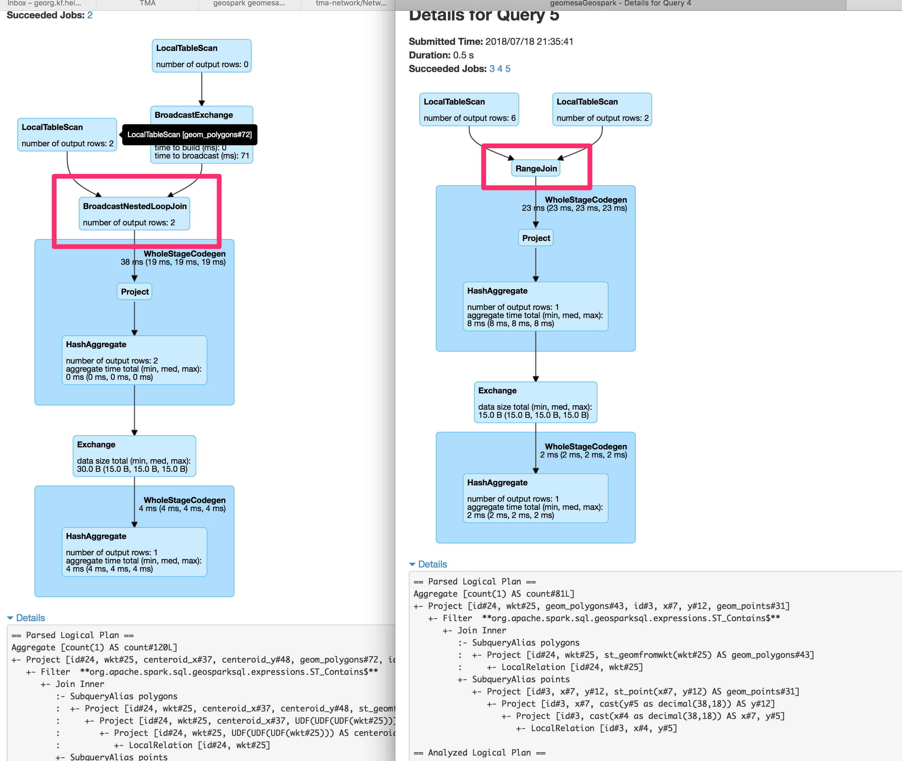

# combine geospatial tools on spark

I need to combine geomesa and geospark on spark, https://github.com/DataSystemsLab/GeoSpark/issues/253.

to execute use:
```
make run
```

fails with
```
ClassCastException: org.apache.spark.sql.catalyst.expressions.UnsafeArrayData cannot be cast to org.apache.spark.sql.catalyst.InternalRow
```

when not using separate registrators. When doing so as suggested in https://github.com/DataSystemsLab/GeoSpark/issues/253

```
Catalog.expressions.foreach(f => FunctionRegistry.builtin.registerFunction("geospark_" + f.getClass.getSimpleName.dropRight(1), f))
Catalog.aggregateExpressions.foreach(f => sparkSession.udf.register("geospark_" + f.getClass.getSimpleName, f))
```

Exeption goes away. But geomesa is used. When renaming functions to `geospark_ST_Point(x, y)` they no longer seem to be defined.

I can't find them in:

```
FunctionRegistry.functionSet.foreach(println)
```

## edits

- with the help of https://github.com/geoHeil/geomesa-geospark/pull/1/files I dentified that the wrong registrator was used and ordering of registrations is important


one problems remains:
- `18/07/18 21:13:33 WARN UDTRegistration: Cannot register UDT for com.vividsolutions.jts.geom.Geometry, which is already registered. How to fix this easily? Shading JTS & registrator does not seem to be a maintainble idea
- understand why ordering is imortant and why if geomesa first and geospark second the error is:

```
Exception in thread "main" java.lang.ClassCastException: org.apache.spark.sql.catalyst.expressions.UnsafeArrayData cannot be cast to org.apache.spark.sql.catalyst.InternalRow
```

- query plans are impacted. Geospark optimizations are only used when not using it in conjunction with geomesa
```
make runGeosparkSolo
```

Inline-style: 


### geospark & geomesa

regular join
```
== Physical Plan ==
*HashAggregate(keys=[], functions=[count(1)], output=[count#120L])
+- Exchange SinglePartition
   +- *HashAggregate(keys=[], functions=[partial_count(1)], output=[count#124L])
      +- *Project
         +- BroadcastNestedLoopJoin BuildRight, Inner,  **org.apache.spark.sql.geosparksql.expressions.ST_Contains$**
            :- LocalTableScan [geom_polygons#72]
            +- BroadcastExchange IdentityBroadcastMode
               +- LocalTableScan [geom_points#60]
```

### geospark solo

optimized range join
```
== Physical Plan ==
*HashAggregate(keys=[], functions=[count(1)], output=[count#81L])
+- Exchange SinglePartition
   +- *HashAggregate(keys=[], functions=[partial_count(1)], output=[count#85L])
      +- *Project
         +- RangeJoin geom_polygons#43: geometry, geom_points#31: geometry, false
            :- LocalTableScan [geom_polygons#43]
            +- LocalTableScan [geom_points#31]
```
